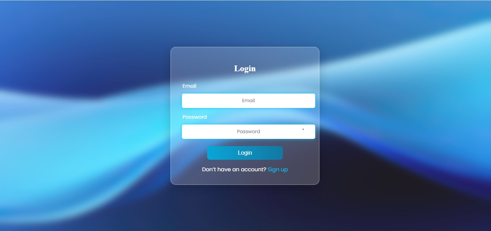

# Glassmorphism Login Form ✨

A modern and stylish **Login Form** built using **HTML, CSS, and a bit of JavaScript**, featuring a beautiful **glassmorphism effect** with smooth gradients and interactive input fields.  

## 🚀 Features
- Glassmorphism design with blurred background  
- Fully responsive layout  
- Animated gradient login button  
- Password visibility toggle (👁 show/hide)  
- Smooth hover & focus effects  
- Clean and minimal UI  

## 📸 Preview
  
*(Here is the ss of the form design)*  

## 🛠️ Tech Stack
- **HTML5**  
- **CSS3** (with glassmorphism + gradients)  
- **JavaScript** (for password toggle)  

## 📂 How to Use
1. Clone this repository:  
   ```bash
   git clone https://github.com/YasirAwaan/Glass-login-ui.git
